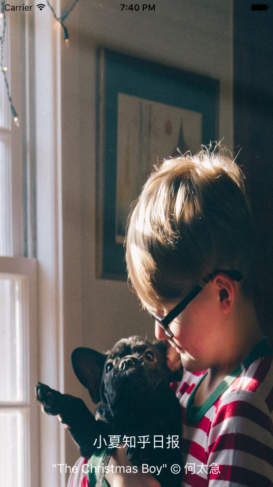
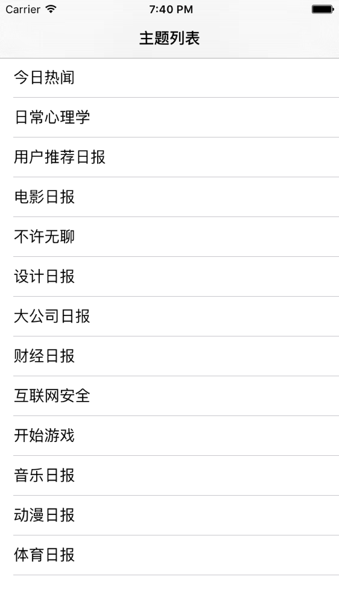
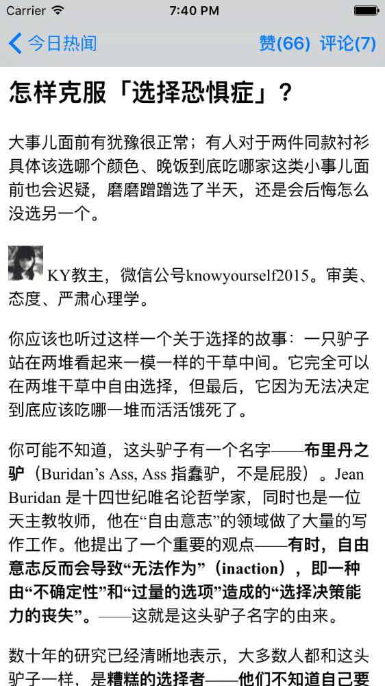
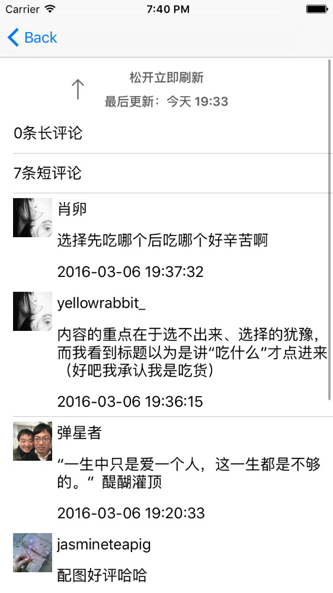

# XiaoxiaZhihu_iOS

---

参考知乎日报，使用网络上的Api，仿写了一个知乎日报客户端。

由于使用非正常手段获取Api，若被告知需停止共享与使用，本人会及时删除此页面与整个项目。

最近在研究iOS,以前也写过Android的demo,现在用OC重新写了一遍,第一次写iOS代码,问题比较多,欢迎大家提意见.

使用最简单的MVC模式,网络层通信使用AFNetworking,json解析使用YYModel,图片加载使用了SDWebImage,同时界面中使用了MJRefresh,Masonry,MBProgressHUD.

## Android客户端

[Android客户端](https://github.com/LiushuiXiaoxia/XiaoxiaZhihu)

## 主要使用组件

```
pod "YYModel"
pod 'AFNetworking', '~> 3.0.4'
pod 'YYImage'
pod 'SDWebImage', '~>3.7'
pod 'MBProgressHUD', '~>0.9.2'
pod 'Masonry', '~>0.6.4' # UI layout
pod 'MJRefresh'
pod 'CocoaLumberjack' # log
```

## 效果图









